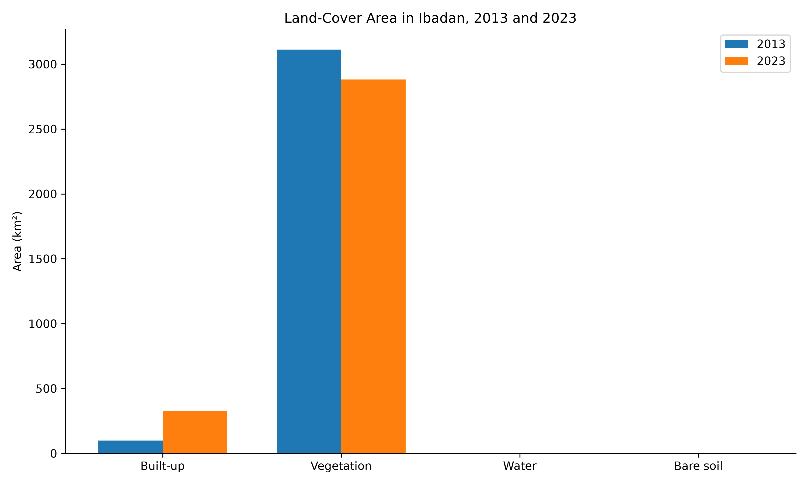
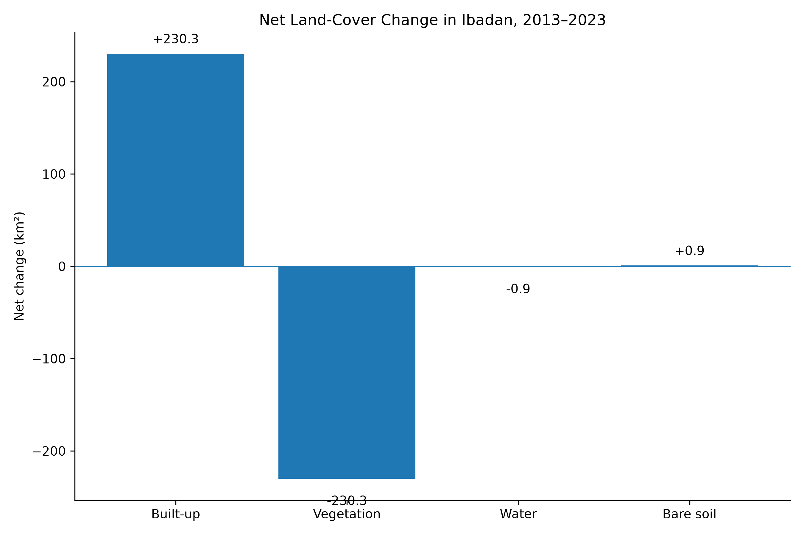
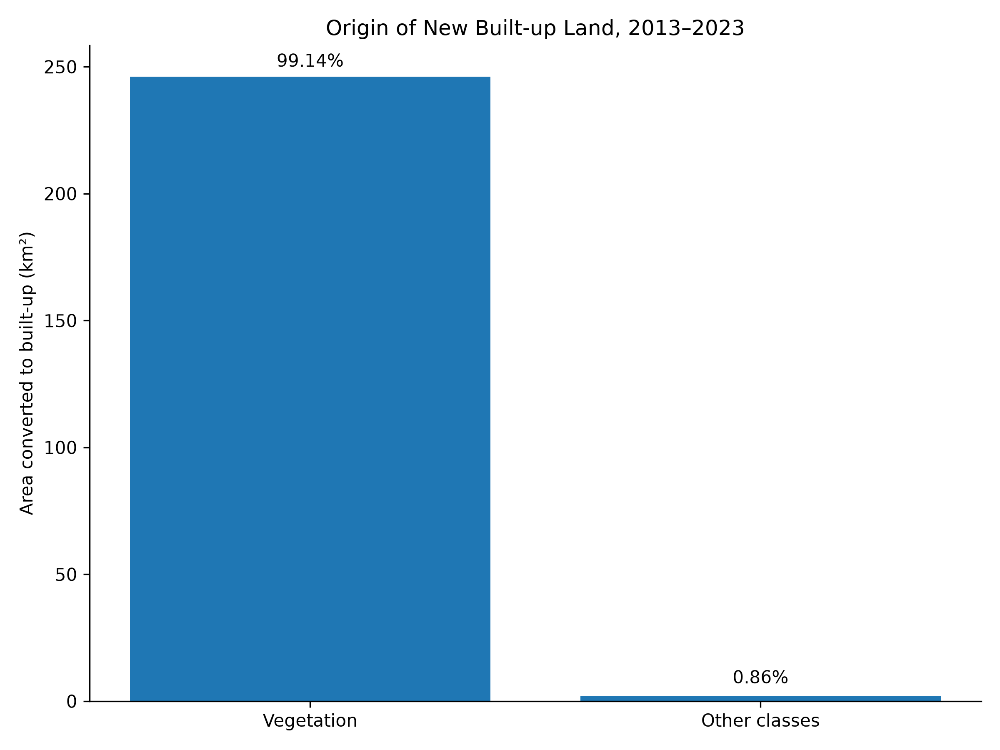
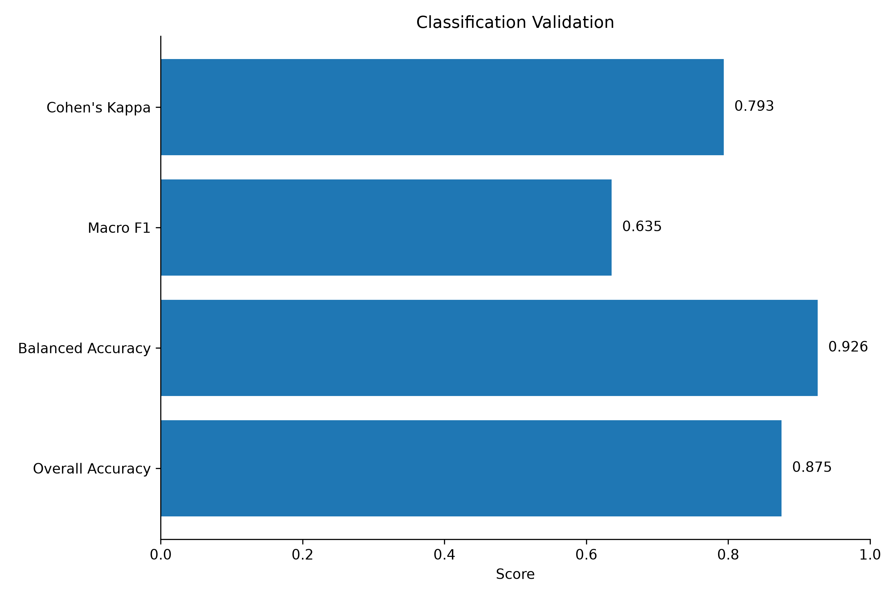

# Ibadan Land-Cover Change and Urban Expansion, 2013–2023

  

## Planning question

**How did Ibadan's land cover change between 2013 and 2023, and what types of land were converted as the city expanded?**

Ibadan expanded substantially during the decade. I used Landsat surface-reflectance imagery, spectral indices and Random Forest classification to map four broad land-cover classes — **Built-up, Vegetation, Water and Bare soil** — on the same 30 m analysis footprint for 2013 and 2023.

The central finding is straightforward: **built-up land increased from about 100 km² to 330 km², and almost all gross new built-up land was mapped as vegetation ten years earlier.**

## Key findings

| Indicator | Result |
|---|---:|
| Analysis area | **3,220.581 km²** |
| Built-up, 2013 | **99.866 km² (3.101%)** |
| Built-up, 2023 | **330.177 km² (10.252%)** |
| Net built-up increase | **230.311 km²** |
| Relative built-up increase | **230.62%** |
| Gross new built-up land | **248.235 km²** |
| Vegetation → Built-up | **246.104 km²** |
| Gross new built-up originating from vegetation | **99.14%** |
| Stable landscape | **91.50%** |
| Changed landscape | **8.50%** |

## Visual evidence

### Land-cover area comparison

### Net land-cover change

### Origin of new built-up land

### Classification validation

## Method

The analysis used Landsat surface-reflectance bands **SR_B2–SR_B7** together with **NDVI, NDBI and MNDWI**. Both years were aligned to a common **30 m** grid in **WGS 84 / UTM Zone 31N (EPSG:32631)**. A Random Forest classifier mapped the four land-cover classes, followed by post-classification change and transition analysis.

The workflow was:

1. Prepare comparable Landsat predictor stacks for 2013 and 2023.
2. Develop reference samples for Built-up, Vegetation, Water and Bare soil.
3. Train the Random Forest classification model.
4. Classify both years on one common analysis footprint.
5. Evaluate the accepted classification with an independent holdout.
6. Calculate class areas, net change, transitions and built-up expansion.
7. Translate the results into planning-focused maps, charts and tables.

## Validation

The independent holdout contained **16 samples**, of which **14 were correctly classified**.

| Metric | Result |
|---|---:|
| Overall Accuracy | **0.8750** |
| Balanced Accuracy | **0.9259** |
| Macro F1 | **0.6354** |
| Cohen's Kappa | **0.7935** |

Because the holdout is small, these metrics should be interpreted together with the raw **14/16** result.

## What changed?

Built-up land increased by **230.311 km²** while vegetation declined by **230.331 km²**. The dominant mapped transition was **Vegetation → Built-up**, covering **246.104 km²**.

Of the **248.235 km²** of gross new built-up land, **99.14%** had been classified as vegetation in 2013. This makes vegetation conversion the defining land-cover pattern associated with Ibadan's mapped urban expansion during the study period.

## Planning value

The spatial pattern points to substantial outward growth and pressure on peripheral green and open land. For planning practice, the results support:

- closer monitoring of urban growth fronts;
- stronger coordination between infrastructure provision and new development;
- integration of green-space protection into expansion strategies; and
- periodic remote-sensing updates to support development management.

The analysis identifies **where physical land-cover conversion occurred**. It does not, on its own, establish the demographic, economic or regulatory causes of that change.

## Land-cover transition matrix

All values are km².

| 2013 → 2023 | Built-up | Vegetation | Water | Bare soil |
|---|---:|---:|---:|---:|
| **Built-up** | 81.9414 | 17.8236 | 0.0360 | 0.0648 |
| **Vegetation** | **246.1041** | 2861.2584 | 0.6633 | 4.2075 |
| **Water** | 0.0072 | 1.5570 | 3.4992 | 0.0000 |
| **Bare soil** | 2.1240 | 1.2636 | 0.0009 | 0.0297 |

Machine-readable results are available in [`outputs/tables`](outputs/tables/).

## Repository guide

- [`outputs/maps`](outputs/maps/) — final cartographic outputs
- [`outputs/charts`](outputs/charts/) — statistical and validation figures
- [`outputs/tables`](outputs/tables/) — machine-readable results
- [`docs/METHODOLOGY.md`](docs/METHODOLOGY.md) — analytical method
- [`docs/RESULTS.md`](docs/RESULTS.md) — detailed findings
- [`docs/LIMITATIONS.md`](docs/LIMITATIONS.md) — interpretation boundaries
- [`docs/PROJECT_REPORT.md`](docs/PROJECT_REPORT.md) — project report

## Tools

Google Earth Engine · Landsat Collection 2 Surface Reflectance · Python · Rasterio · GeoPandas · Pandas · NumPy · scikit-learn · Matplotlib · GIS · Git · GitHub

## Limitations

- The independent holdout contains only **16 samples**.
- Landsat's **30 m** resolution can produce mixed pixels in heterogeneous urban areas.
- The four-class system generalises more detailed urban and environmental land-cover categories.
- Spectral consistency does not substitute for independent ground-reference observations.
- Land-cover transitions do not establish socioeconomic, demographic or regulatory causation.

The results are therefore best used for **metropolitan-scale urban-growth and land-cover interpretation**, not parcel-level development decisions.

## Author

**Abdullah Abdazeez Ayomide**  
Urban & Regional Planner · GIS & Remote Sensing · Spatial Decision Support

## Citation

**Abdullah Abdazeez Ayomide (2026). _Ibadan Land-Cover Change and Urban Expansion, 2013–2023_.**
