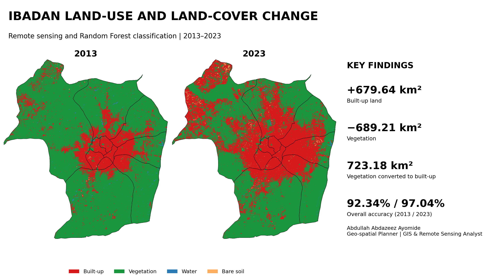
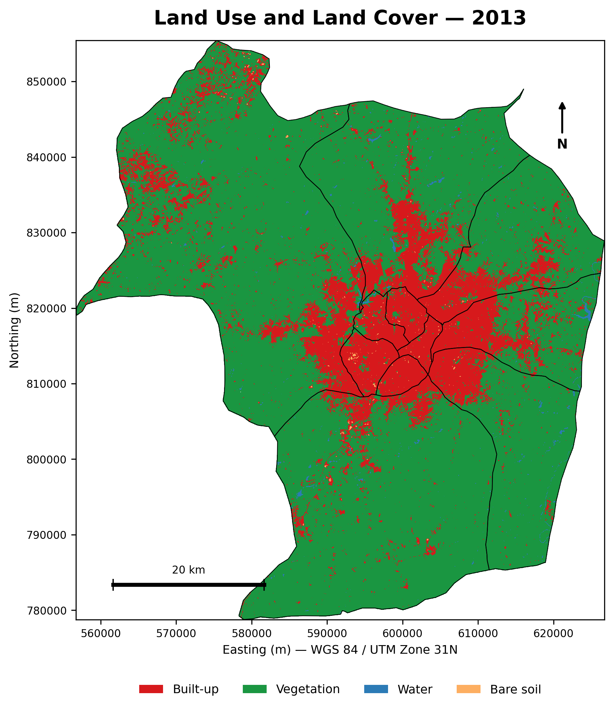
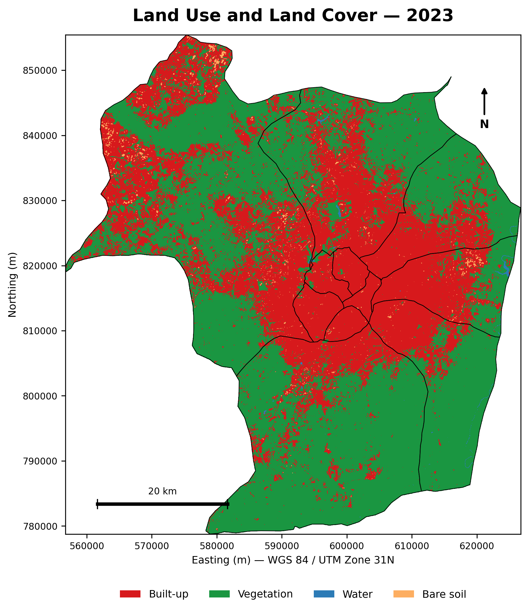
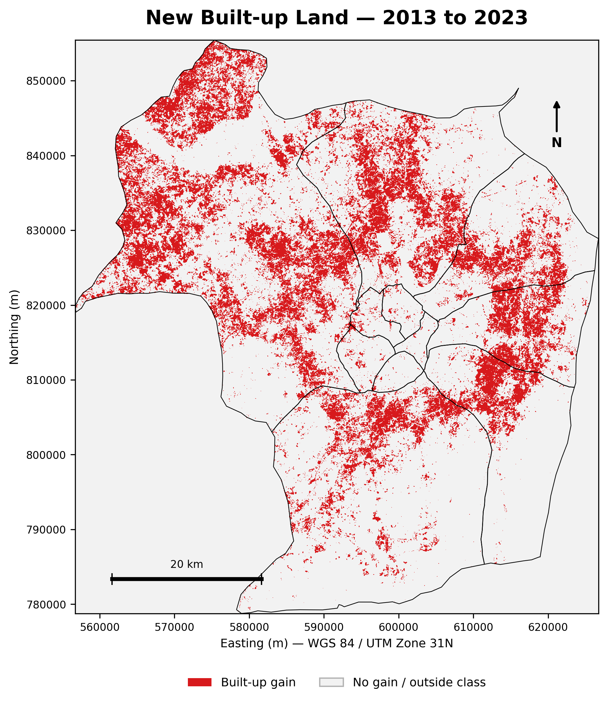
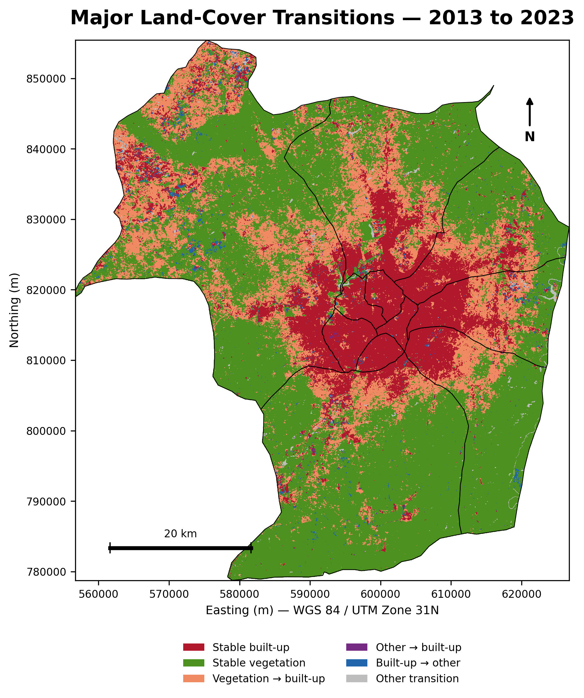
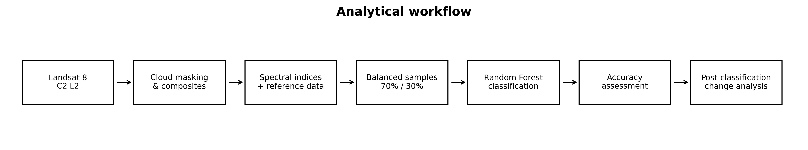
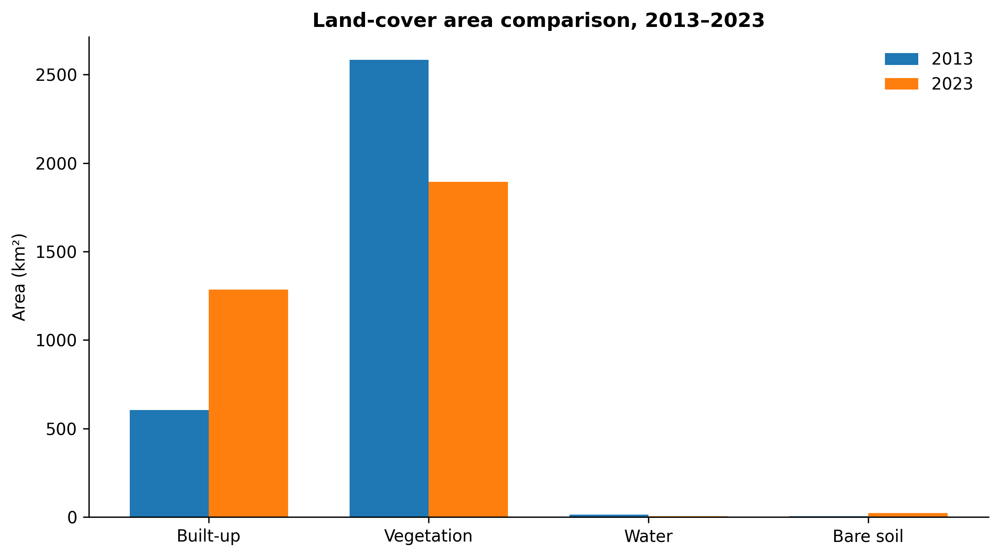
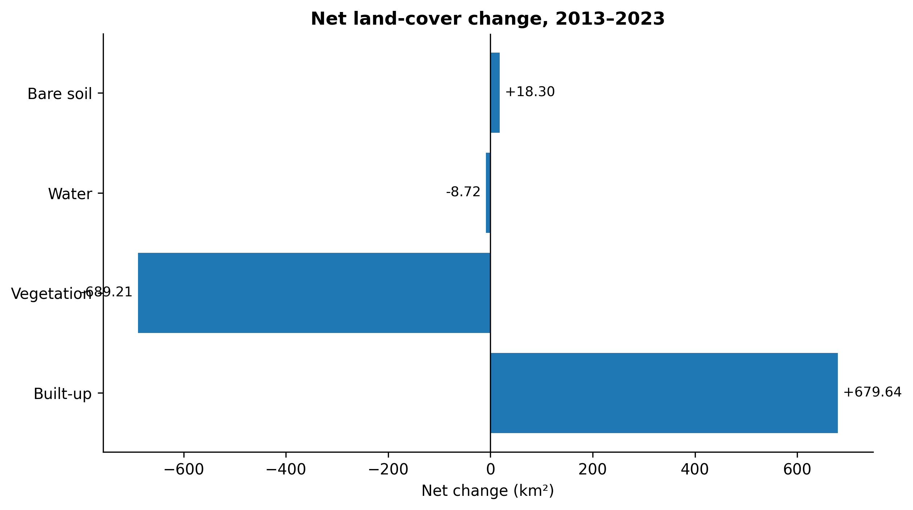
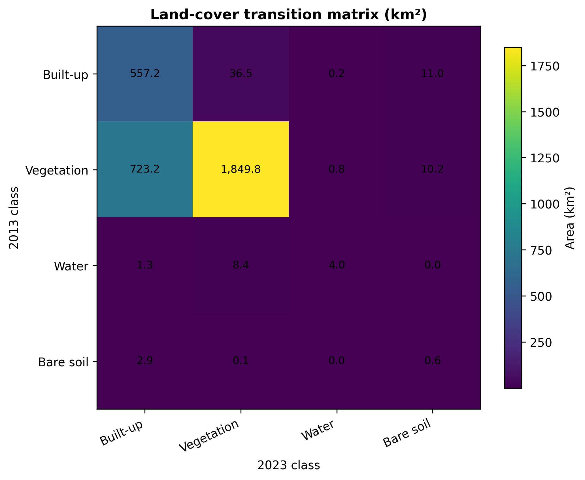

<p align="center">
  
</p>

# Land-Use and Land-Cover Change in Ibadan Metropolitan Area (2013–2023)

Ibadan’s outward expansion is changing the balance between urban development and natural land cover across its eleven metropolitan LGAs. This project used Landsat 8 surface-reflectance imagery, spectral indices, Dynamic World reference information, and separate Random Forest models to map built-up land, vegetation, water, and bare soil in 2013 and 2023. Post-classification comparison was then used to quantify net change, identify the main conversion pathways, and map where new development occurred.

Built-up land increased from **604.85 km² to 1,284.49 km²**, representing a net gain of **679.64 km² (112.36%)**. Vegetation declined by **689.21 km²**, and the transition matrix showed that **723.18 km² of vegetation changed to built-up land**. Classification achieved **92.34% overall accuracy (Kappa 0.895)** for 2013 and **97.04% (Kappa 0.961)** for 2023. The results provide spatial evidence for growth-management, infrastructure coordination, green-space protection, and continued monitoring of metropolitan expansion.

| Project detail | Information |
|---|---|
| **Study area** | Eleven LGAs in Ibadan Metropolitan Area, Oyo State, Nigeria |
| **Period** | 2013–2023 |
| **Mapped area** | Approximately 3,206.26 km² |
| **Primary imagery** | Landsat 8 Collection 2 Level-2 surface reflectance |
| **Resolution** | 30 m |
| **Classification** | Separate four-class Random Forest models, 300 trees |
| **Projection** | WGS 84 / UTM Zone 31N (EPSG:32631) |

## Key findings

- Built-up land expanded by **679.64 km²**, increasing its share of the mapped area from **18.86% to 40.06%**.
- Vegetation decreased by **689.21 km²**, falling from **80.59% to 59.10%** of the study area.
- **Vegetation → built-up** was the dominant transition, covering **723.18 km²**.
- Built-up persistence accounted for **557.16 km²**, while **1,849.84 km²** remained vegetated.
- The 2023 model produced the stronger validation result: **97.04% overall accuracy** and **0.961 Kappa**.

## Project maps

<table>
<tr>
<td width="50%"><br><b>2013 land cover</b></td>
<td width="50%"><br><b>2023 land cover</b></td>
</tr>
<tr>
<td width="50%"><br><b>New built-up land</b></td>
<td width="50%"><br><b>Major land-cover transitions</b></td>
</tr>
</table>

## Analytical workflow

<p align="center"></p>

The workflow applies QA-based masking and surface-reflectance scaling, builds spectral composites and indices, prepares balanced reference samples, trains separate 2013 and 2023 Random Forest classifiers, evaluates performance with held-out validation samples, and performs post-classification change analysis. The complete Earth Engine implementation is available in [`scripts/gee/ibadan_lulc_final_gee_script.js`](scripts/gee/ibadan_lulc_final_gee_script.js).

## Quantitative results

<p align="center"></p>
<p align="center"></p>
<p align="center"></p>

| Class | 2013 area (km²) | 2023 area (km²) | Net change (km²) | Change (%) |
|---|---:|---:|---:|---:|
| Built-up | 604.85 | 1,284.49 | +679.64 | +112.36 |
| Vegetation | 2,584.05 | 1,894.84 | −689.21 | −26.67 |
| Water | 13.74 | 5.02 | −8.72 | −63.44 |
| Bare soil | 3.62 | 21.92 | +18.30 | +505.46 |

Water and bare-soil results should be interpreted carefully because these classes occupy small areas and are especially sensitive to seasonal and spectral variation.

## Planning relevance

The analysis shows that metropolitan expansion was driven mainly by the conversion of vegetated land into built-up surfaces. The mapped growth pattern can support development monitoring, infrastructure phasing, peri-urban growth management, green-space protection, and the identification of locations requiring more detailed planning assessment. The outputs are intended as metropolitan-scale evidence rather than parcel-level development approval data.

## Repository contents

```text
.
├── assets/                     # Project cover and social-preview graphic
├── data/processed/             # Final rasters, tables, and boundary files
├── docs/                       # Data, methodology, results, and limitations
├── notebooks/                  # Results-review notebook
├── outputs/maps/               # Publication-ready project maps
├── outputs/charts/             # Workflow and statistical figures
├── outputs/tables/             # Cleaned summary and validation tables
├── scripts/gee/                # Full Google Earth Engine workflow
├── scripts/python/             # Local result-reproduction script
└── validation/                 # Repository validation outputs
```

## Reproducibility

1. Open the GEE script in the Earth Engine Code Editor and confirm the study-area and imagery collections.
2. Run the workflow to recreate the classified rasters and exported tables.
3. Install the local requirements with `pip install -r requirements.txt`.
4. Run `python scripts/python/reproduce_summary.py` to verify the supplied tables and raster properties.
5. Review [`docs/METHODOLOGY.md`](docs/METHODOLOGY.md) and [`docs/LIMITATIONS.md`](docs/LIMITATIONS.md) before interpreting the results.

## Author

**Abdullah Abdazeez Ayomide**  
Geo-spatial Planner | GIS & Remote Sensing Analyst

- [GitHub](https://github.com/Abdullahabdazeez)
- [LinkedIn](https://ng.linkedin.com/in/abdazeez-abdullah-4b814719a)
- [Email](mailto:abdazeezabdullah1@gmail.com)

## Citation and licence

Citation metadata is provided in [`CITATION.cff`](CITATION.cff). Code is released under the MIT License. Source imagery and administrative data remain subject to their providers’ terms.
