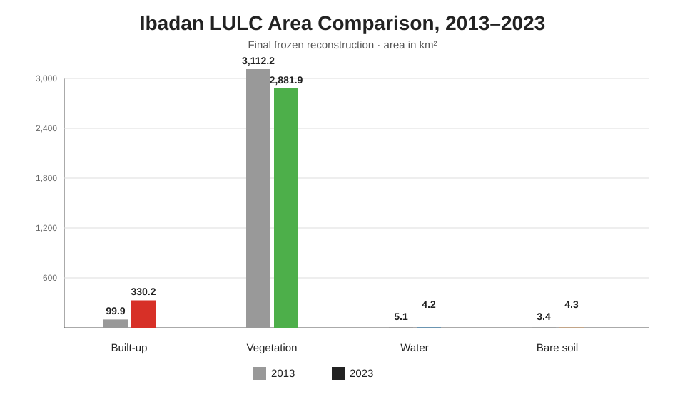
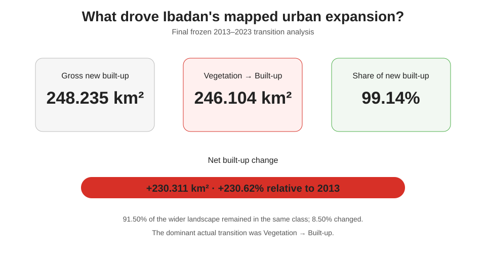
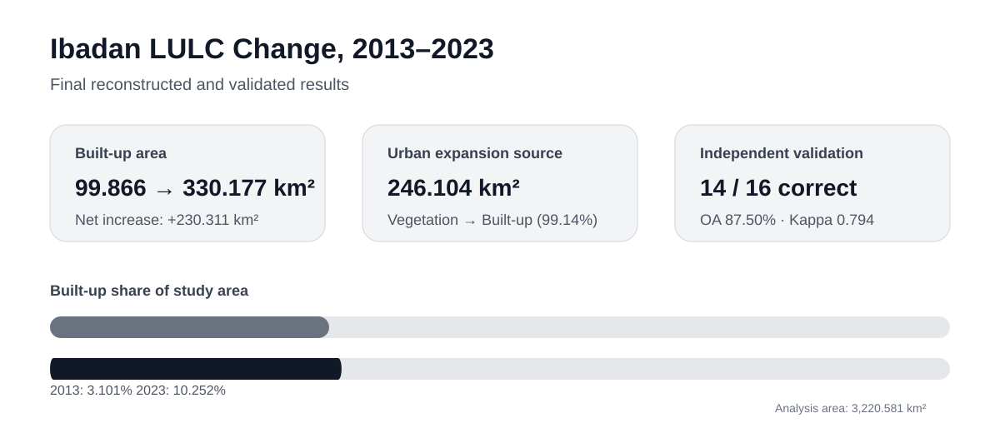
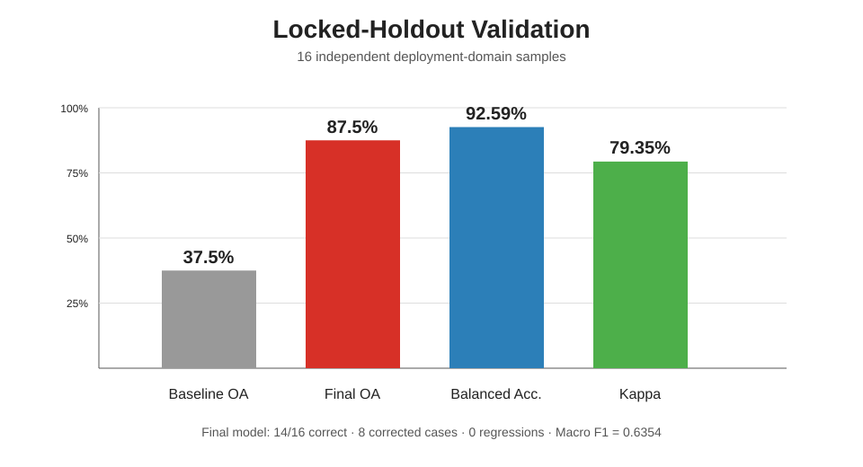

# Charts — Ibadan Land-Cover Change and Urban Expansion

These figures summarise the main quantitative evidence from my analysis of Ibadan's land-cover change between 2013 and 2023. They complement the maps by showing the scale, direction and reliability of the observed changes at a glance.

## Land-cover area comparison

*Comparison of the mapped area of Built-up, Vegetation, Water and Bare soil in 2013 and 2023.*

## Land-cover change summary

*Net change by land-cover class over the ten-year study period.*

## Project overview

*Headline indicators from the land-cover change and urban-expansion analysis.*

## Independent validation

*Performance measures from the independent holdout used to evaluate the final classification.*

## Headline result

Built-up land increased from **99.866 km²** to **330.177 km²**, while Vegetation declined by **230.331 km²**. The strongest mapped transition was **Vegetation → Built-up (246.104 km²)**.

Area totals explain **how much** change occurred; the maps show **where** it occurred. Validation metrics describe classification performance and are reported separately from the magnitude of urban growth.

---

**Abdullah Abdazeez Ayomide**  
Urban & Regional Planner · GIS & Remote Sensing · Spatial Decision Support
